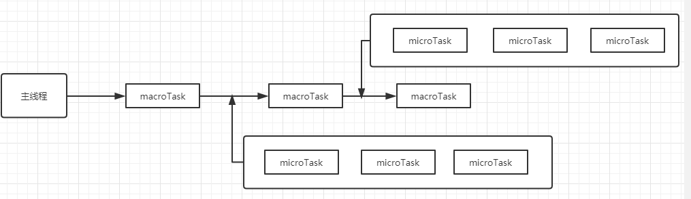
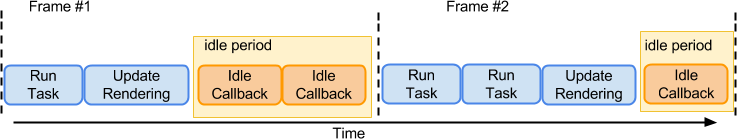
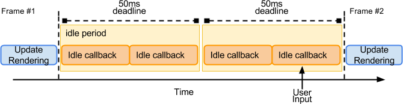

# 
事件循环

## 浏览器中的事件循环

JavaScript代码的执行过程中，除了依靠函数调用栈来搞定函数的执行顺序外，还依靠任务队列(task queue)来搞定另外一些代码的执行。整个执行过程，我们称为事件循环过程。一个线程中，事件循环是唯一的，但是任务队列可以拥有多个。任务队列又分为**macro-task**（宏任务）**与micro-task**（微任务），在最新标准中，它们被分别称为task与jobs。

**macro-task大概包括：**

* script(整体代码)
* setTimeout
* setInterval
* setImmediate
* I/O
* UI render

**micro-task大概包括:**

* process.nextTick
* Promise
* Async/Await
* MutationObserver

下面是`Event Loop`的示意图:

### 流程

1. 从任务队列中取出一个宏任务并执行。

2. 检查微任务队列，执行并清空微任务队列，如果在微任务的执行中又加入了新的微任务，也会在这一步一起执行。

3. 进入更新渲染阶段，判断是否需要渲染，这里有一个 rendering opportunity 的概念，也就是说不一定每一轮 `event loop` 都会对应一次浏览 器渲染，要根据屏幕刷新率、页面性能、页面是否在后台运行来共同决定，通常来说这个渲染间隔是固定的。（所以多个 task 很可能在一次渲染之间执行）

	* 浏览器会尽可能的保持帧率稳定，例如页面性能无法维持 60fps（每 16.66ms 渲染一次）的话，那么浏览器就会选择 30fps 的更新速率，而不是偶尔丢帧。
	* 如果浏览器上下文不可见，那么页面会降低到 4fps 左右甚至更低。
	* 如果满足以下条件，也会跳过渲染：
	 * 浏览器判断更新渲染不会带来视觉上的改变。
	 * map of animation frame callbacks 为空，也就是帧动画回调为空，可以通过 `requestAnimationFrame` 来请求帧动画。
 
4. 如果上述的判断决定本轮不需要渲染，那么下面的几步也不会继续运行：

	> This step enables the user agent to prevent the steps below from running for other reasons, for example, to ensure certain tasks are executed immediately after each other, with only microtask checkpoints interleaved (and without, e.g., animation frame callbacks interleaved). Concretely, a user agent might wish to coalesce timer callbacks together, with no intermediate rendering updates. 有时候浏览器希望两次「定时器任务」是合并的，他们之间只会穿插着 microTask的执行，而不会穿插屏幕渲染相关的流程。

5. 对于需要渲染的文档，如果窗口的大小发生了变化，执行监听的 `resize` 方法。

6. 对于需要渲染的文档，如果页面发生了滚动，执行 `scroll` 方法。

7. 对于需要渲染的文档，执行帧动画回调，也就是 `requestAnimationFrame` 的回调。

8. 对于需要渲染的文档， 执行 `IntersectionObserver` 的回调。

9. 对于需要渲染的文档，**重新渲染**绘制用户界面。

10. 判断 `task`队列和`microTask`队列是否都为空，如果是的话，则进行 Idle 空闲周期的算法，判断是否要执行 `requestIdleCallback` 的回调函数。

对于`resize` 和 `scroll`来说，并不是到了这一步才去执行滚动和缩放，那岂不是要延迟很多？浏览器当然会立刻帮你滚动视图，根据CSSOM 规范所讲，浏览器会保存一个 pending scroll event targets，等到事件循环中的 `scroll`这一步，去派发一个事件到对应的目标上，驱动它去执行监听的回调函数而已。`resize`也是同理。

可以在这个流程中仔细看一下「宏任务」、「微任务」、「渲染」之间的关系。

下面的章节中咱们来详细聊聊 **requestIdleCallback** 和 **requestAnimationFrame**。

#### requestAnimationFrame

(以下内容中 `requestAnimationFrame`简称为**rAF**)

在解读规范的过程中，我们发现 `requestAnimationFrame` 的回调有两个特征：

- 在重新渲染前调用。
- 很可能在宏任务之后不调用

我们来分析一下，为什么要在重新渲染前去调用？因为 **rAF** 是官方推荐的用来做一些流畅动画所应该使用的 API，做动画不可避免的会去更改 DOM，而如果在渲染之后再去更改 DOM，那就只能等到下一轮渲染机会的时候才能去绘制出来了，这显然是不合理的。

**rAF**在浏览器决定渲染之前给你最后一个机会去改变 DOM 属性，然后很快在接下来的绘制中帮你呈现出来，所以这是做流畅动画的不二选择。

#### requestIdleCallback

(以下内容中 `requestIdleCallback`简称为**rIC**。)

我们都知道 `requestIdleCallback` 是浏览器提供给我们的空闲调度算法，关于它的简介可以看 MDN 文档，意图是让我们把一些计算量较大但是又没那么紧急的任务放到空闲时间去执行。不要去影响浏览器中优先级较高的任务，比如动画绘制、用户输入等等。

渲染有序进行
首先看一张图，很精确的描述了这个 API 的意图：

当然，这种有序的 `浏览器 -> 用户 -> 浏览器 -> 用户` 的调度基于一个前提，就是我们要把任务切分成比较小的片，不能说浏览器把空闲时间让给你了，你去执行一个耗时 **10s** 的任务，那肯定也会把浏览器给阻塞住的。这就要求我们去读取 **rIC** 提供给你的 **deadline** 里的时间，去动态的安排我们切分的小任务。浏览器信任了你，你也不能辜负它呀。
渲染长期空闲

还有一种情况，也有可能在几帧的时间内浏览器都是空闲的，并没有发生任何影响视图的操作，它也就不需要去绘制页面：
这种情况下为什么还是会有 **50ms** 的 **deadline** 呢？是因为浏览器为了提前应对一些可能会突发的用户交互操作，比如用户输入文字。如果给的时间太长了，你的任务把主线程卡住了，那么用户的交互就得不到回应了。**50ms** 可以确保用户在无感知的延迟下得到回应。

草案中还提到：

- 当浏览器判断这个页面对用户不可见时，这个回调执行的频率可能被降低到 10s 执行一次，甚至更低。这点在解读 **Event Loop** 中也有提及。

- 如果浏览器的工作比较繁忙的时候，不能保证它会提供空闲时间去执行 **rIC** 的回调，而且可能会长期的推迟下去。所以如果你需要保证你的任务在一定时间内一定要执行掉，那么你可以给 **rIC** 传入第二个参数 timeout。
这会强制浏览器不管多忙，都在超过这个时间之后去执行 **rIC** 的回调函数。所以要谨慎使用，因为它会打断浏览器本身优先级更高的工作。

- 最长期限为 50 ms，是根据研究得出的，研究表明，人们通常认为 100ms 内对用户输入的响应是瞬时的。 将闲置截止期限设置为 50ms 意味着即使在闲置任务开始后立即发生用户输入，浏览器仍然有剩余的 50ms 可以在其中响应用户输入而不会产生用户可察觉的滞后。

- 每次调用 `timeRemaining()` 函数判断是否有剩余时间的时候，如果浏览器判断此时有优先级更高的任务，那么会动态的把这个值设置为 0，否则就是用预先设置好的 `deadline - now` 去计算。

- 这个 `timeRemaining()` 的计算非常动态，会根据很多因素去决定，所以不要指望这个时间是稳定的。

## 总结
通过本文的学习过程，我自己也打破了很多对于 `Event Loop` 以及 **rAF**、**rIC** 函数的固有错误认知，通过本文我们可以整理出以下的几个关键点。

- 事件循环不一定每轮都伴随着重渲染，但是如果有微任务，一定会伴随着微任务执行。
- 决定浏览器视图是否渲染的因素很多，浏览器是非常聪明的。
- **requestAnimationFrame**在重新渲染屏幕之前执行，非常适合用来做动画。
- **requestIdleCallback**在渲染屏幕之后执行，并且是否有空执行要看浏览器的调度，如果你一定要它在某个时间内执行，请使用 timeout参数。
- **resize**和**scroll**事件其实自带节流，它只在 `Event Loop` 的渲染阶段去派发事件到 `EventTarget` 上。

### 重绘和回流其实和 Event loop 有关
* 当 `Event loop` 执行完 **Microtasks** 后，会判断 document 是否需要更新。因为浏览器是 60Hz的刷新率，每 16ms 才会更新一次。
* 然后判断是否有 resize 或者 scroll ，有的话会去触发事件，所以 **resize** 和 **scroll** 事件也是至少 16ms 才会触发一次，并且自带节流功能。
* 判断是否触发了**media query**
* 更新动画并且发送事件
* 判断是否有全屏操作事件
* 执行 **requestAnimationFrame** 回调
* 执行 **IntersectionObserver** 回调，该方法用于判断元素是否可见，可以用于懒加载上，但是兼容性不好
* 更新界面
* 以上就是一帧中可能会做的事情。如果在一帧中有空闲时间，就会去执行 **requestIdleCallback** 回调