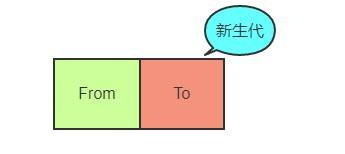
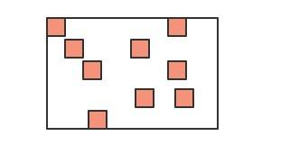
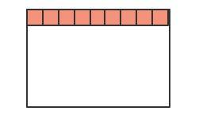

# 
垃圾回收

JS 语言不像 C/C++, 让程序员自己去开辟或者释放内存，而是类似Java，采用自己的一套垃圾回收算法进行自动的内存管理。
作为一名资深的前端工程师，对于JS内存回收的机制是需要非常清楚，以便于在极端的环境下能够分析出系统性能的瓶颈，另一方面，学习
这其中的机制，也对我们深入理解JS的闭包特性、以及对内存的高效使用，都有很大的帮助。

## V8的内存限制

在其他的后端语言中，如Java/Go, 对于内存的使用没有什么限制，但是JS不一样，V8只能使用系统的一部分内存，具体来说，在`64 位`系统下，V8最多只能分配`1.4G`, 在 `32 位`系统中，最多只能分配`0.7G`。你想想在前端这样的大内存需求其实并不大，但对于后端而言，nodejs如果遇到一个2G多的文件，那么将无法全部将其读入内存进行各种操作了。

我们知道对于栈内存而言，当ESP指针下移，也就是上下文切换之后，栈顶的空间会自动被回收。但对于堆内存而言就比较复杂了，我们下面着重分析堆内存的垃圾回收。

所有的对象类型的数据在JS中都是通过堆进行空间分配的。当我们构造一个对象进行赋值操作的时候，其实相应的内存已经分配到了堆上。你可以不断的这样创建对象，让 V8 为它分配空间，直到堆的大小达到上限。

那么问题来了，V8 为什么要给它设置内存上限？明明我的机器几十G的内存，只能让我用这么一点？

究其根本，是由两个因素所共同决定的，一个是JS单线程的执行机制，另一个是JS垃圾回收机制的限制。

- **JS单线程机制**：作为浏览器的脚本语言，JS的主要用途是与用户交互以及操作DOM，那么这也决定了其作为单线程的本质，单线程意味着执行的代码必须按顺序执行，在同一时间只能处理一个任务。试想如果JS是多线程的，一个线程在删除DOM元素的同时，另一个线程对该元素进行修改操作，那么必然会导致复杂的同步问题。既然JS是单线程的，那么也就意味着在V8执行垃圾回收时，程序中的其他各种逻辑都要进入暂停等待阶段，直到垃圾回收结束后才会再次重新执行JS逻辑。因此，由于JS的单线程机制，垃圾回收的过程阻碍了主线程逻辑的执行。

- **垃圾回收机制**：垃圾回收本身也是一件非常耗时的操作，假设V8的堆内存为1.5G，那么V8做一次小的垃圾回收需要50ms以上，而做一次非增量式回收甚至需要1s以上，可见其耗时之久，而在这1s的时间内，浏览器一直处于等待的状态，同时会失去对用户的响应，如果有动画正在运行，也会造成动画卡顿掉帧的情况，严重影响应用程序的性能。因此如果内存使用过高，那么必然会导致垃圾回收的过程缓慢，也就会导致主线程的等待时间越长，浏览器也就越长时间得不到响应。

可见其耗时之久，而且在这么长的时间内，我们的JS代码执行会一直没有响应，造成应用卡顿，导致应用性能和响应能力直线下降。因此，V8 做了一个简单粗暴的
选择，那就是限制堆内存，也算是一种权衡的手段，因为大部分情况是不会遇到操作几个G内存这样的场景的。

##  V8的堆构成

V8的堆其实并不只是由老生代和新生代两部分构成，可以将堆分为几个不同的区域：

- **新生代内存区**：大多数的对象被分配在这里，这个区域很小但是垃圾回特别频繁；

- **老生代指针区**：属于老生代，这里包含了大多数可能存在指向其他对象的指针的对象，大多数从新生代晋升的对象会被移动到这里；

- **老生代数据区**：属于老生代，这里只保存原始数据对象，这些对象没有指向其他对象的指针；

- **大对象区**：这里存放体积超越其他区大小的对象，每个对象有自己的内存，垃圾回收其不会移动大对象；

- **代码区**：代码对象，也就是包含JIT之后指令的对象，会被分配在这里。唯一拥有执行权限的内存区；

- Cell区、属性Cell区、Map区：存放Cell、属性Cell和Map，每个区域都是存放相同大小的元素，结构简单。

每个区域都是由一组内存页构成，内存页是V8申请内存的最小单位，除了大对象区的内存页较大以外，其他区的内存页都是1MB大小，而且按照1MB对 齐。内存页除了存储的对象，还有一个包含元数据和标识信息的页头，以及一个用于标记哪些对象是活跃对象的位图区。另外每个内存页还有一个单独分配在另外内 存区的槽缓冲区，里面放着一组对象，这些对象可能指向其他存储在该页的对象。垃圾回收器只会针对新生代内存区、老生代指针区以及老生代数据区进行垃圾回收。

## V8 的垃圾回收机制

### 如何判断回收内容

如何确定哪些内存需要回收，哪些内存不需要回收，这是垃圾回收期需要解决的最基本问题。我们可以这样假定，一个对象为活对象当且仅当它被一个根对象 或另一个活对象指向。根对象永远是活对象，它是被浏览器或V8所引用的对象。被局部变量所指向的对象也属于根对象，因为它们所在的作用域对象被视为根对象。

### 如何识别指针和数据

垃圾回收器需要面临一个问题，它需要判断哪些是数据，哪些是指针。由于很多垃圾回收算法会将对象在内存中移动（紧凑，减少内存碎片），所以经常需要进行指针的改写：

目前主要有三种方法来识别指针：

- 保守法：将所有堆上对齐的字都认为是指针，那么有些数据就会被误认为是指针。于是某些实际是数字的假指针，会背误认为指向活跃对象，导致内存泄露（假指针指向的对象可能是死对象，但依旧有指针指向——这个假指针指向它）同时我们不能移动任何内存区域。

- 编译器提示法：如果是静态语言，编译器能够告诉我们每个类当中指针的具体位置，而一旦我们知道对象时哪个类实例化得到的，就能知道对象中所有指针。这是JVM实现垃圾回收的方式，但这种方式并不适合JS这样的动态语言

- 标记指针法：这种方法需要在每个字末位预留一位来标记这个字段是指针还是数据。这种方法需要编译器支持，但实现简单，而且性能不错。V8采用的是这种方式。V8将所有数据以32bit字宽来存储，其中最低一位保持为0，而指针的最低两位为01

### 回收策略

Chrome中的V8采用了一种分代回收的策略，将内存分为两个生代：**新生代**和**老生代**。**新生代**的对象为存活时间较短的对象，**老生代**中的对象为存活时间较长或常驻内存的对象。然后分别对**新生代**和**老生代**使用不同的垃圾回收算法来提升垃圾回收的效率。对象起初都会被分配到**新生代**，当**新生代**中的对象满足某些条件（后面会有介绍）时，会被移动到**老生代**（晋升）。

### 分代内存

默认情况下，64位环境下的V8引擎的新生代内存大小32MB、老生代内存大小为1400MB，而32位则减半，分别为16MB和700MB。V8内存的最大保留空间分别为1464MB（64位）和732MB（32位）。具体的计算公式是4*reserved_semispace_space_ + max_old_generation_size_，新生代由两块reserved_semispace_space_组成，每块16MB（64位）或8MB（32位）。

## 新生代

### 新生代的特点：

大多数的对象被分配在这里，这个区域很小但是垃圾回特别频繁。在新生代分配内存非常容易，我们只需要保存一个指向内存区的指针，不断根据新对象的大小进行递增即可。当该指针到达了新生代内存区的末尾，就会有一次清理（仅仅是清理新生代）。

### 新生代的垃圾回收算法：

新生代使用Scavenge算法进行回收。在Scavenge算法的实现中，主要采用了Cheney算法。

Cheney 算法是一种采用复制的方式实现的垃圾回收算法。它将内存一分为二，每一部分空间称为 semispace。在这两个 semispace 中，一个处于使用状态，另一个处于闲置状态。处于使用状态的 semispace空间称为 From 空间，处于闲置状态的空间称为 To 空间。

当我们分配对象时，先是在 From 空间中进行分配。当开始进行垃圾回收算法时，会检查 From 空间中的存活对象，这些存活对象将会被复制到 To 空间中（复制完成后会进行紧缩，复制的过程采用的是 BFS – 广度优先遍历的思想，从根对象出发，广度优先遍历所有能到达的对象。），而非活跃对象占用的空间将会被释放。

完成复制后，From 空间和 To 空间的角色发生对换。也就是说，在垃圾回收的过程中，就是通过将存活对象在两个 semispace 之间进行复制。

可以很容易看出来，使用 Cheney 算法时，总有一半的内存是空的。但是由于新生代很小，所以浪费的内存空间并不大。而且由于新生代中的对象绝大部分都是非活跃对象，需要复制的活跃对象比例很小，所以其时间效率十分理想。

具体的执行过程大致是这样：

首先将 From 空间中所有能从根对象到达的对象复制到 To 区，然后维护两个To区的指针 scanPtr 和 allocationPtr ，分别指向即将扫描的活跃对象和即将为新对象分配内存的地方，开始循环。

循环的每一轮会查找当前 scanPtr 所指向的对象，确定对象内部的每个指针指向哪里。如果指向老生代我们就不必考虑它了。如果指向 From 区，我们就需要把这个所指向的对象从 From 区复制到 To 区，具体复制的位置就是 allocationPtr 所指向的位置。复制完成后将 scanPtr 所指对象内的指针修改为新复制对象存放的地址，并移动 allocationPtr 。

如果一个对象内部的所有指针都被处理完，scanPtr 就会向前移动，进入下一个循环。若scanPtr 和 allocationPtr 相遇，则说明所有的对象都已被复制完，From 区剩下的都可以被视为垃圾，可以进行清理了。

**具体看下面的例子：**

首先将新生代内存空间一分为二:

其中From部分表示正在使用的内存，To 是目前闲置的内存。

当进行垃圾回收时，V8 将From部分的对象检查一遍，如果是存活对象那么复制到To内存中(在To内存中按照顺序从头放置的)，如果是非存活对象直接回收即可。

当所有的From中的存活对象按照顺序进入到To内存之后，From 和 To 两者的角色对调，From现在被闲置，To为正在使用，如此循环。

那你很可能会问了，直接将非存活对象回收了不就万事大吉了嘛，为什么还要后面的一系列操作？

注意，我刚刚特别说明了，在To内存中按照顺序从头放置的，这是为了应对这样的场景:

深色的小方块代表存活对象，白色部分表示待分配的内存，由于堆内存是连续分配的，这样零零散散的空间可能会导致稍微大一点的对象没有办法进行空间分配，

这种零散的空间也叫做内存碎片。刚刚介绍的新生代垃圾回收算法也叫Scavenge算法。

Scavenge 算法主要就是解决内存碎片的问题，在进行一顿复制之后，To空间变成了这个样子:

是不是整齐了许多？这样就大大方便了后续连续空间的分配。
不过Scavenge 算法的劣势也非常明显，就是内存只能使用新生代内存的一半，但是它只存放生命周期短的对象，这种对象一般很少，因此时间性能非常优秀。

### 写屏障

如果新生区中某个对象，只有一个指向它的指针，而这个指针恰好是在老生区的对象当中，我们如何才能知道新生区中那个对象是活跃的呢？显然我们并不希望将老生区再遍历一次，因为老生区中的对象很多，这样做一次消耗太大。

为了解决这个问题，实际上在写缓冲区中有一个列表，列表中记录了所有老生区对象指向新生区的情况。新对象诞生的时候，并不会有指向它的指针，而当有老生区中的对象出现指向新生区对象的指针时，我们便记录下来这样的跨区指向。由于这种记录行为总是发生在写操作时，它被称为**写屏障**——因为每个写操作都要经历这样一关。

你可能好奇，如果每次进行写操作都要经过写屏障，岂不是会多出大量的代码么？没错，这就是我们这种垃圾回收机制的代价之一。但情况没你想象的那么严重，写操作毕竟比读操作要少。某些垃圾回收算法（不是V8的）会采用读屏障，而这需要硬件来辅助才能保证一个较低的消耗。V8也有一些优化来降低写屏障带来的消耗：

- 大多数的脚本执行时间都是发生在 Crankshaft 当中的，而 Crankshaft 常常能静态地判断出某个对象是否处于新生区。对于指向这些对象的写操作，可以无需写屏障。

- Crankshaft 中新出现了一种优化，即在对象不存在指向它的非局部引用时，该对象会被分配在栈上。而一个栈上对象的相关写操作显然无需写屏障。（译注：新生区和老生区在堆上。）

- “老→新”这样的情况相对较为少见，因此通过将“新→新”和“老→老”两种常见情况的代码做优化，可以相对提升多数情形下的性能。每个页都以1MB对齐，因此给定一个对象的内存地址，通过将低20bit滤除来快速定位其所在的页；而页头有相关的标识来表明其属于新生区还是老生区，因此通过判断两个对象所属的区域，也可以快速确定是否是“老→新”。

- 一旦我们找到“老→新”的指针，我们就可以将其记录在写缓冲区的末端。经过一定的时间（写缓冲区满的时候），我们将其排序，合并相同的项目，然后再除去已经不符合“老→新”这一情形的指针。（译注：这样指针的数目就会减少，写屏障的时间相应也会缩短

### 对象的晋升

当一个对象经过多次复制仍然存活时，它就会被认为是生命周期较长的对象。这种较长生命周期的对象随后会被移动到老生代中，采用新的算法进行管理。

**对象从新生代移动到老生代的过程叫作晋升。**

具体移动的标准有两种：

- 对象从From空间复制到To空间时，会检查它的内存地址来判断这个对象是否已经经历过一次Scavenge回收。如果已经经历过了，会将该对象从From空间移动到老生代空间中，如果没有，则复制到To空间。**总结来说，如果一个对象是第二次经历从From空间复制到To空间，那么这个对象会被移动到老生代中。**

-  当要从From空间复制一个对象到To空间时，如果To空间已经使用了超过25%，则这个对象直接晋升到老生代中。设置25%这个阈值的原因是当这次Scavenge回收完成后，这个To空间会变为From空间，接下来的内存分配将在这个空间中进行。如果占比过高，会影响后续的内存分配。

## 老生代

### 老生代的特点：

老生代所保存的对象大多数是生存周期很长的甚至是常驻内存的对象，而且老生代占用的内存较多。

### 老生代的垃圾回收算法：

老生代占用内存较多（64位为1.4GB，32位为700MB），如果使用 Scavenge 算法，浪费一半空间不说，复制如此大块的内存消耗时间将会相当长。所以 Scavenge 算法显然不适合。V8在老生代中的垃圾回收策略采用 **Mark-Sweep**（标记清除）和 **Mark-Compact**（标记整理）相结合。

**Mark-Sweep**（标记清除）

标记清除分为标记和清除两个阶段。在标记阶段需要遍历堆中的所有对象，并标记那些活着的对象，然后进入清除阶段。在清除阶段中，只清除没有被标记的对象。由于标记清除只清除死亡对象，而死亡对象在老生代中占用的比例很小，所以效率较高。标记清除有一个问题就是进行一次标记清楚后，内存空间往往是不连续的，会出现很多的内存碎片。如果后续需要分配一个需要内存空间较多的对象时，如果所有的内存碎片都不够用，将会使得V8无法完成这次分配，提前触发垃圾回收。

**Mark-Compact**（标记整理）

标记整理正是为了解决标记清除所带来的内存碎片的问题。标记整理在标记清除的基础进行修改，将其清除阶段变为紧缩极端。在整理的过程中，将活着的对象向内存区的一段移动，移动完成后直接清理掉边界外的内存。紧缩过程涉及对象的移动，所以效率并不是太好，但是能保证不会生成内存碎片。

**结合使用标记清除和标记整理**

在 Mark-Sweep 和 Mark-Compact 之间，由于 Mark-Compact 需要移动对象，所以它的执行速度不可能很快，所以在取舍上，V8 主要使用 Mark-Sweep（而非递进使用），在空间不足以对从新生代中晋升过来对象进行分配时才使用 Mark-Compact。

## 垃圾回收引发的性能问题

### 全停顿

由于 JavaScript 是运行在主线程之上的，一旦执行垃圾回收算法，都需要将正在执行的 JavaScript 脚本暂停下来，待垃圾回收完毕后再恢复脚本执行。我们把这种行为叫做**全停顿**（Stop-The-World）。

比如堆中的数据有 1.5GB，V8 实现一次完整的垃圾回收需要 1 秒以上的时间，这也是由于垃圾回收而引起 JavaScript 线程暂停执行的时间，若是这样的时间花销，那么应用的性能和响应能力都会直线下降。

在 V8 新生代的垃圾回收中，因其空间较小，且存活对象较少，所以全停顿的影响不大，但老生代就不一样了。如果在执行垃圾回收的过程中，占用主线程时间过久，就像上面图片展示的那样，花费了 200 毫秒，在这 200 毫秒内，主线程是不能做其他事情的。比如页面正在执行一个 JavaScript 动画，因为垃圾回收器在工作，就会导致这个动画在这 200 毫秒内无法执行的，这将会造成页面的卡顿现象。

## 性能优化

### Incremental Marking（增量标记）

为了降低老生代的垃圾回收而造成的卡顿，V8 将标记过程分为一个个的子标记过程，同时让垃圾回收标记和 JavaScript 应用逻辑交替进行，直到标记阶段完成，我们把这个算法称为**增量标记**（Incremental Marking）算法。

由于JS的单线程机制，V8 在进行垃圾回收的时候，不可避免地会阻塞业务逻辑的执行，倘若老生代的垃圾回收任务很重，那么耗时会非常可怕，严重影响应用的性能。

那这个时候为了避免这样问题，V8 采取了增量标记的方案，即将一口气完成的标记任务分为很多小的部分完成，每做完一个小的部分就"歇"一下，就js应用逻辑执行一会儿，然后再执行下面的部分，如果循环，直到标记阶段完成才进入内存碎片的整理上面来。其实这个过程跟React Fiber的思路有点像，这里就不展开了。

经过增量标记之后，垃圾回收过程对JS应用的阻塞时间减少到原来了1 / 6, 可以看到，这是一个非常成功的改进。

### lazy sweeping (惰性清理)

由于标记完成后，所有的对象都已经被标记，不是死对象就是活对象，堆上多少空间格局已经确定。我们可以不必着急释放那些死对象所占用的空间，而延迟清理过程的执行。垃圾回收器可以根据需要逐一清理死对象所占用的内存页