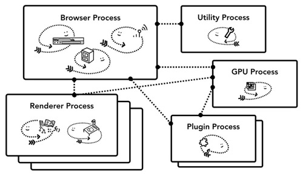
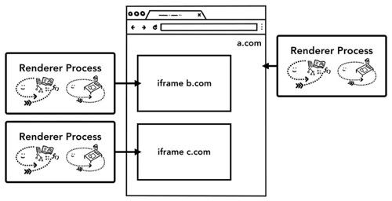

# 
浏览器-内部结构

## 内部结构

### CPU
	
**中央处理器**（**Central Processing Unit**，简称为 **CPU** ）。CPU 可以看作是计算机的大脑。一个 CPU 核心如图中的办公人员，可以逐一解决很多不同任务。它可以在解决从数学到艺术一切任务的同时还知道如何响应客户要求。过去 CPU 大多是单芯片的，一个核心就像存在于同芯片的另一个 CPU。随着现代硬件发展，你经常会有不止一个内核，为你的手机和笔记本电脑提供更多的计算能力。

### GPU

**图形处理器**（**Graphics Processing Unit**，简称为 **GPU**）是计算机的另一部件。与 CPU 不同，GPU 擅长同时处理跨内核的简单任务。顾名思义，它最初是为解决图形而开发的。这就是为什么在图形环境中“使用 GPU” 或 “GPU 支持”都与快速渲染和顺滑交互有关。近年来随着 GPU 加速计算的普及，仅靠 GPU 一己之力也使得越来越多的计算成为可能。

**进程与线程** 
 
进程可以被描述为是一个应用的执行程序。线程存在于进程并执行程序任意部分。

启动应用时会创建一个进程。程序也许会创建一个或多个线程来帮助它工作，这是可选的。操作系统为进程提供了一个可以使用的“一块”内存，所有应用程序状态都保存在该私有内存空间中。关闭应用程序时，相应的进程也会消失，操作系统会释放内存。

进程可以请求操作系统启动另一个进程来执行不同的任务。此时，内存中的不同部分会分给新进程。如果两个进程需要对话，他们可以通过**进程间通信（IPC）**来进行。许多应用都是这样设计的，所以如果一个工作进程失去响应，该进程就可以在不停止应用程序不同部分的其他进程运行的情况下重新启动。

### 浏览器架构

在 Chrome 中, 对于渲染进程来说，创建了多个渲染进程并分配给了每个标签页。直到最近，Chrome 在可能的情况下给每个标签页分配一个进程。而现在它试图给每个站点分配一个进程，包括 iframe。

具体说来，Chrome 的主要进程及其职责如下：

- Browser Process：
	- 负责包括地址栏，书签栏，前进后退按钮等部分的工作；
	- 负责处理浏览器的一些不可见的底层操作，比如网络请求和文件访问；
- Renderer Process：
	- 负责一个 tab 内关于网页呈现的所有事情
- Plugin Process：
	- 负责控制一个网页用到的所有插件，如 flash
- GPU Process
	- 负责处理 GPU 相关的任务

#### 进程各自控制什么？

| 进程 | 控制 |
| ---- | --- |
| 浏览器 | 控制应用中的 “Chrome” 部分，包括地址栏，书签，回退与前进按钮。以及处理 web 浏览器不可见的特权部分，如网络请求与文件访问。|
| 渲染| 控制标签页内网站展示。| 
| 插件| 控制站点使用的任意插件，如 Flash。| 
| GPU| 处理独立于其它进程的 GPU 任务。GPU 被分成不同进程，因为 GPU 处理来自多个不同应用的请求并绘制在相同表面。| 

#### Chrome 多进程架构的优点

**优点**
  
- 某一渲染进程出问题不会影响其他进程
- 更为安全，在系统层面上限定了不同进程的权限

**缺点**

- 由于不同进程间的内存不共享，不同进程的内存常常需要包含相同的内容。

最简单的情况下，你可以想象每个标签页都有自己的渲染进程。假设你打开了三个标签页，每个标签页都拥有自己独立的渲染进程。如果某个标签页失去响应，你可以关掉这个标签页，此时其它标签页依然运行着，可以正常使用。如果所有标签页都运行在同一进程上，那么当某个失去响应，所有标签页都会失去响应。这样的体验很糟糕。

把浏览器工作分成多个进程的另一好处是安全性与沙箱化。由于操作系统提供了限制进程权限的方法，浏览器就可以用沙箱保护某些特定功能的进程。例如，Chrome 浏览器限制处理任意用户输入的进程(如渲染器进程)对任意文件的访问。

由于进程有自己的私有内存空间，所以它们通常包含公共基础设施的拷贝(如 V8，它是 Chrome 的 JavaScript 引擎)。这意味着使用了更多的内存，如果它们是同一进程中的线程，就无法共享这些拷贝。为了节省内存，Chrome 对可加速的内存数量进行了限制。具体限制数值依设备可提供的内存与 CPU 能力而定，但是当 Chrome 运行时达到限制时，会开始在同一站点的不同标签页上运行同一进程。

#### 节省更多内存 —— Chrome 中的服务化

通常观点是当 Chrome 运行在强力硬件上时，它会将每个服务分解到不同进程中，从而提升稳定性，但是如果 Chrome 运行在资源有限的设备上时，它会将服务聚合到一个进程中从而节省了内存占用。在这一架构变革实现前，类似的整合进程以减少内存使用的方法已经在 Android 类平台上使用。

#### iframe 的渲染 —— Site Isolation

**站点隔离** 是近期引入到 Chrome 中的一个功能，它为每个 iframe 运行一个单独的渲染进程。我们已经讨论了许久每个标签页的渲染进程，它允许跨站点 iframe 运行在一个单独的渲染进程，在不同站点中共享内存。运行 a.com 与 b.com 在同一渲染进程中看起来还 ok。

**同源策略** 是 web 的核心安全模型。同源策略确保站点在未得到其它站点许可的情况下不能获取其数据。安全攻击的一个主要目标就是绕过同源策略。进程隔离是分离站点的最高效的手段。随着 Meltdown and Spectre 的出现，使用进程来分离站点愈发势在必行。Chrome 67 版本后，桌面版 Chrome 都默认开启了站点隔离，每个标签页的 iframe 都有一个单独的渲染进程。

>Site Isolation 被大家看做里程碑式的功能， 其成功实现是多年工程努力的结果。Site Isolation 不是简单的叠加多个进程。这种机制在底层改变了 iframe 之间通信的方法，Chrome 的其它功能都需要做对应的调整，比如说 devtools 需要相应的支持，甚至 Ctrl + F 也需要支持。
