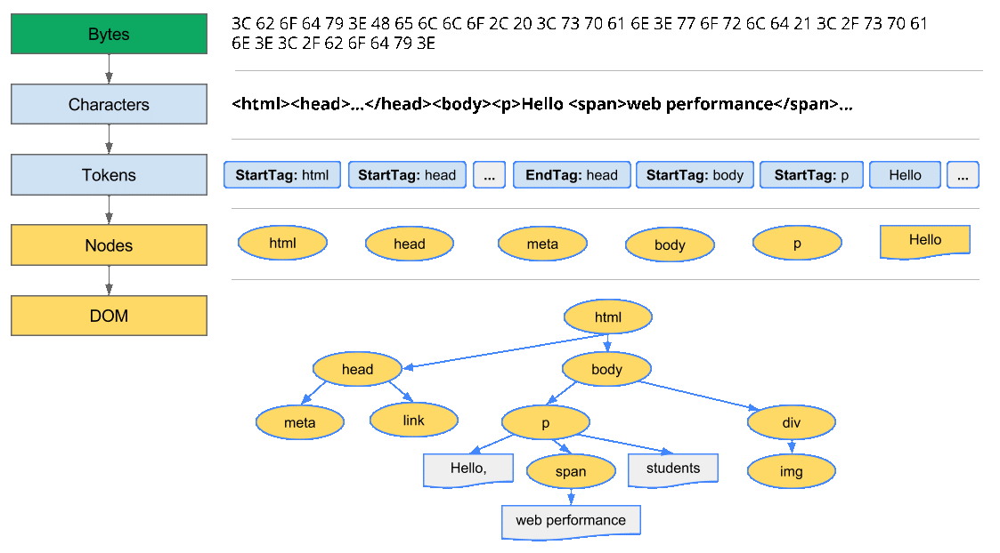
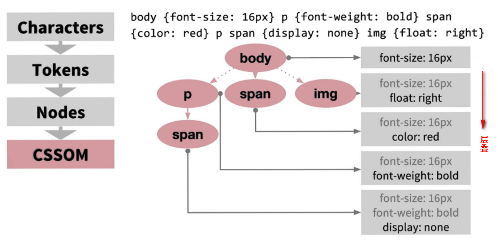

# <center>构建对象模型</center>

## 文档对象模型 DOM

浏览器解析HTML，构建DOM树。 解析HTML到构建出DOM当然过程可以简述如下：

> **字节 → 字符 → 标记 → 节点 → 对象模型**。


例如:

```html
<html>
  <head>
    <meta name="viewport" content="width=device-width,initial-scale=1">
    <link href="style.css" rel="stylesheet">
    <title>Critical Path</title>
  </head>
  <body>
    <p>Hello <span>web performance</span> students!</p>
    <div></div>
  </body>
</html>
```

HTML解析器输出的树是由DOM元素和属性节点组成的，它是HTML文档的对象化描述，也是HTML元素与外界（如Javascript）的接口.



`
Bytes → characters → tokens → nodes → DOM
`

其中比较关键的几个步骤：

- Conversion转换：浏览器将获得的HTML内容（Bytes）基于他的编码转换为单个字符
- Tokenizing分词：浏览器按照HTML规范标准将这些字符转换为不同的标记token。每个token都有自己独特的含义以及规则集
- Lexing词法分析：分词的结果是得到一堆的token，此时把他们转换为节点对象，这些对象分别定义他们的属性和规则 
- DOM构建：因为HTML标记定义的就是不同标签之间的关系，这个关系就像是一个树形结构一样
例如：body对象的父节点就是HTML对象，然后段落p对象的父节点就是body对象

事实上，构建DOM的过程中，不是等所有Token都转换完成后再去生成节点对象，而是一边生成Token一边消耗Token来生成节点对象。换句话说，每个Token被生成后，会立刻消耗这个Token创建出节点对象。注意：带有结束标签标识的Token不会创建节点对象。

还有两点需要特别注意的地方。

1. DOM 树解析的过程是一个深度优先遍历，即先构建当前节点的所有子节点，再构建下一个兄弟节点。

2. 若遇到 JavaScript 标签，则 DOM 树的构建会暂停，直至脚本执行完毕。

## CSS对象模型 CSSOM

在浏览器构建这个简单页面的 DOM 过程中，在文档的 head 中遇到了一个 link 标记，该标记引用一个外部 CSS 样式表：style.css。由于预见到需要利用该资源来渲染页面，它会立即发出对该资源的请求，并返回以下内容：

```css
body { font-size: 16px }
p { font-weight: bold }
span { color: red }
p span { display: none }
img { float: right }
```

我们本可以直接在 HTML 标记内声明样式（内联），但让 CSS 独立于 HTML 有利于我们将内容和设计作为独立关注点进行处理：设计人员负责处理 CSS，开发者侧重于 HTML，等等。

与处理 HTML 时一样，我们需要将收到的 CSS 规则转换成某种浏览器能够理解和处理的东西。因此，我们会重复 HTML 过程，不过是为 CSS 而不是 HTML：

`
Bytes → characters → tokens → nodes → CSSOM
`

CSS 字节转换成字符，接着转换成tokens和节点，最后链接到一个称为“CSS 对象模型”(CSSOM) 的树结构：




<Valine></Valine>