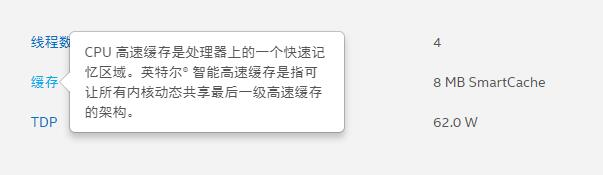
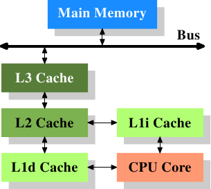

# 
CPU缓存

## CPU缓存是什么？

CPU缓存的定义为CPU与内存之间的临时数据交换器，它的出现是为了解决CPU运行处理速度与内存读写速度不匹配的矛盾——缓存的速度比内存的速度快多了。CPU缓存一般直接跟CPU芯片集成或位于主板总线互连的独立芯片上。（现阶段的CPU缓存一般直接集成在CPU上）CPU往往需要重复处理相同的数据、重复执行相同的指令，如果这部分数据、指令CPU能在CPU缓存中找到，CPU就不需要从内存或硬盘中再读取数据、指令，从而减少了整机的响应时间。

## CPU缓存速度和内存速度差多少？

我们来简单地打个比方：如果CPU在L1一级缓存中找到所需要的资料要用的时间为3个周期左右，那么在L2二级缓存找到资料的时间就要10个周期左右，L3三级缓存所需时间为50个周期左右；如果要到内存上去找呢，那就慢多了，可能需要几百个周期的时间。

对CPU缓存有一定了解了吗，让我们再深入一点。以Intel为例，Intel官网上产品-处理器界面内对缓存的定义为：“CPU高速缓存是处理器上的一个快速记忆区域。英特尔智能高速缓存（SmartCache）是指可让所有内核动态共享最后一级高速缓存的架构。”这里就提及到了最后一级高速缓存的概念，即为CPU缓存中的L3(三级缓存)，那么我们继续来解释一下什么叫三级缓存，分别又是指哪三级缓存。

## 三级缓存（L1、L2、L3）是什么？

以近代CPU的视角来说，三级缓存（包括L1一级缓存、L2二级缓存、L3三级缓存）都是集成在CPU内的缓存，它们的作用都是作为CPU与主内存之间的高速数据缓冲区，L1最靠近CPU核心；L2其次；L3再次。运行速度方面：L1最快、L2次快、L3最慢；容量大小方面：L1最小、L2较大、L3最大。CPU会先在最快的L1中寻找需要的数据，找不到再去找次快的L2，还找不到再去找L3，L3都没有那就只能去内存找了。L1、L2、L3可以说是各有特点，下面我们就分开来讲一下。

### 一级缓存（L1 Cache）

一级缓存这个名词出现应该是在Intel公司Pentium处理器时代把缓存开始分类的时候，当时在CPU内部集成的CPU缓存已经不能满足整机的性能需求，而制造工艺上的限制不能在CPU内部大幅提高缓存的数量，所以出现了集成在主板上的缓存，当时人们把CPU内部集成的CPU缓存成为一级缓存，在CPU外部主板上的缓存称为二级缓存。

而一级缓存其实还分为一级数据缓存（Data Cache，D-Cache，L1d）和一级指令缓存(Instruction Cache，I-Cache，L1i)，分别用于存放数据及执行数据的指令解码，两者可同时被CPU访问，减少了CPU多核心、多线程争用缓存造成的冲突，提高了处理器的效能。一般CPU的L1i和L1d具备相同的容量，例如I7-8700K的L1即为32KB+32KB。

### 二级缓存（L2 Cache）

随着CPU制造工艺的发展，本来处于CPU外部的二级缓存也可以轻易地集成进CPU内部，这种时候再用缓存是否处于CPU内部来判断一二级缓存已经不再确切。集成进CPU的L2二级缓存运行速率渐渐可以跟上CPU的运行速度了，，其主要作用为当CPU在L1中没读取到所需要的数据时再把数据展示给CPU筛选（CPU未命中L1的情况下继续在L2寻求命中，缓存命中的工作原理我们稍后再讲）。

L2二级缓存比L1一级缓存的容量要更大，但是L2的速率要更慢，为什么呢？首先L2比L1要更远离CPU核心，L1是最靠近CPU核心的缓存，CPU需要读取L2的数据从物理距离上比L1要更远；L2的容量比L1更大，打个简单的比喻，在小盒子里面找东西要比在大房间里面找要方便快捷。这里也可以看出，缓存并非越大越好，越靠近CPU核心的缓存运行速率越快越好，非最后一级缓存的缓存容量自然是够用即可。

L2二级缓存实际上就是L1一级缓存跟主内存之间的缓冲器，在2006年的时间点上，Intel和AMD当家在售的几款处理器可以看出他们对最后一级缓存不同的见解：Intel Core Duo不同于它的前辈Pentium D、EE，采用了双核心共享的2M L2二级缓存，是属于当时最先二级缓存架构，即“Smart Cache”共享缓存技术，这种技术沿用到以后的Intel推出的所有多核心处理器上；而AMD Athlon 64 X2处理器则是每个CPU核心都具备独立的二级缓存，Manchester核心的处理器为每核心512KB、Toledo核心为每核心1MB，两个核心之间的缓存的数据同步是通过CPU内置的SRI（系统请求接口）控制，这样的数据延迟及占用资源情况都要比Intel的Pentium D、EE核心要好，但还是比不上Core为代表的Smart Cache缓存共享。

### 三级缓存（L3 Cache）

最初出现L3三级缓存的应该是AMD的K6-III处理器，当时受限于制造工艺，L3只能集成在主板上。然后Intel首次出现L3三级缓存的是Itanium安腾服务器处理器，接着就是P4EE和至强MP。L3三级缓存的出现其实对CPU性能提升呈一个爬坡曲线——L3从0到2M的情况CPU性能提升非常明显，L3从2M到6M提升可能就只有10%不到了，这是在近代CPU多核共享L3的情况下；当L3集成进CPU正式成为CPU内部缓存后，CPU处理数据时只有5%需要在内存中调用数据，进一步地减少了内存延迟，使系统的响应更为快速。

同理，L3即为L2与主内存之间的缓冲器，主要体现在提升处理器大数据处理方面的性能，对游戏表现方面有较大的帮助。那么也许有人就会问了，是不是选择CPU的时候看准L3买，哪个CPU的L3大就买哪个？非也，只有同架构的情况下这种比较才具有意义，先举个比较久远的例子：Intel具备1MB L3的Xeon MP处理器仍然不是AMD没有L3的皓龙处理器对手，再来个现有的：Intel I7-8700K 12MB L3和AMD Threadripper 1950X 32MB L3相比，自然是32MB比12MB大，但是平均下来也是一个核心2MB L3，性能就见仁见智了。

## CPU缓存是怎样帮助CPU工作的呢

由于数据的局限性，CPU往往需要在短时间内重复多次读取数据，内存的运行频率自然是远远跟不上CPU的处理速度的，怎么办呢？缓存的重要性就凸显出来了，CPU可以避开内存在缓存里读取到想要的数据，称之为命中（hit）。L1的运行速度很快，但是它的数据容量很小，CPU能在L1里命中的概率大概在80%左右——日常使用的情况下；L2、L3的机制也类似如此，这样一来，CPU需要在内存中读取的数据大概为5%-10%，其余数据命中全部可以在L1、L2、L3中做到，大大减少了系统的响应时间，总的来说，所有CPU读取数据的顺序都是先缓存再内存。
